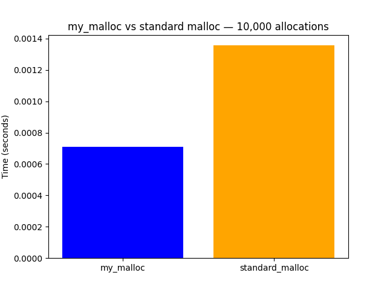

# Memory Allocator in C++

A custom heap memory allocator built from scratch in C++ — no libraries, no malloc, just raw pointer arithmetic.

## What it implements
- `my_malloc` — allocates memory using a first-fit search with block splitting
- `my_free` — frees memory and merges adjacent free blocks (coalescing)
- `my_realloc` — resizes an existing allocation, copying data safely
- `print_heap` — visualizes every block in the heap with address, size, and status
- `print_stats` — shows total used/free memory and block counts
- `benchmark` — compares performance against standard malloc over 10,000 allocations

## How to compile and run
```bash
g++ allocator.cpp -o allocator
./allocator
```

## Benchmark
My allocator vs standard malloc — 10,000 allocations of 64 bytes each.



My allocator outperforms standard malloc for small same-size allocations due to lower overhead. Standard malloc wins for production workloads requiring thread safety and varied allocation sizes.

## What I learned
- How heap memory is structured at the byte level
- How malloc and free actually work under the hood
- Pointer arithmetic and memory casting in C++
- What fragmentation is and how coalescing solves it
- How to benchmark and compare allocator performance
